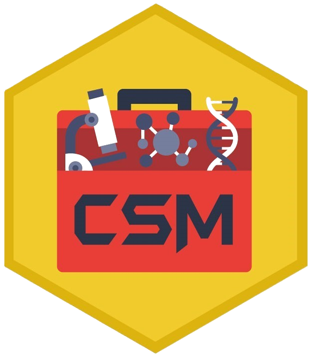

#  Comprehensive Spatial Methods (CSM) R package 
**Summary:** CSM is an R package designed as a toolbox to analyze spatially resolved tissue data. To see a demo of CSM capabilities please see the related [*publication*](publicationURL).


## What you will find in this Repository
+ [Requirements and installation](#Main-features-and-requirements) 
+ [Main outline of CSM](#Main-outline-of-CSM) 
+ [Publication and associated datasets](#Publication) 
+ [Citation](#Images) 
+ [Reporting Bugs](#Reporting-Bugs)

## Main features and requirements
* CSM was developed using R version > 4.3
* CSM depends on many packages. However not all suggested packages are required to perform specific tasks. Functions will return an error if packages they depend on are not installed.
* CSM includes >100 functions organized in 6+1 modules.
* CSM provides several images and datasets to test function capabilities.
* You can install CSM in R using the following code:
```diff
devtools::install_github(Alvaro-LJ/CSM)
```
* You can also download CSM vignettes by setting the build_vignettes argument to TRUE:
```diff
devtools::install_github(Alvaro-LJ/CSM, build_vignettes = TRUE)
```

## Main outline of CSM


- MODULE 0: Data generation and formatting
  - Divide large images into tiles. Useful to work with whole slide images.
  - Perform pixel thresholding and quantification. Aimed at scoring extra-cellular biomolecules.
  - Extract color channels from RGB images. May be required to work with HE, IHC or other histochemical staining techniques.
  - Perform cell segmentation and feature extraction from images.
  - Arrange cell feature matrices into an adequate format.
  - Arrange image metadata into an adequate format.
  - Perform general quality checks and check computational resources available.
  
- MODULE 1: Data normalization
  - Normalize cell feature expression data to account for image and slide belonging.
  
- MODULE 2: Data thresholding
  - Define positive thresholds for features of interest. Thresholded data can be used to assign cell labels.
  
- MODULE 3: Cell phenotype labeling
  - Define cell phenotype labels based on thresholded features (see MODULE 2).
  - Define cell phenotype labels based on unsupervised clustering.
  - Define cell phenotype labels based on semi-supervised clustering.
  - Define cell phenotype labels based on user trained algorithms.
  - Check concordance between different cell phenotyping methods.
  - Assign cell phenotype labels by reaching a consensus using various methods.
  - Quantify cell phenotypes and find associations with image metadata.

- MODULE 4: Heterogeneity assessment
  - Calculate global cell composition heterogeneity.
  - Calculate spatial heterogeneity using tiling approaches as well as texture feature analysis.
  
- MODULE 5: Cell-Cell spatial associations
  - Calculate spatial associations between pairs and thriads of cell types.
  - Calculate spatial association occurring by chance.
  
- MODULE 6: Neighborhood analysis and tissue structures
  - Calculate cellular neighborhoods using various algorithms.
  - Divide tissue into compartments according to a single cell type (for example Tumor/Stromal compartments).

## Publication
To see examples of use of CSM you can have a look at CSM associated [*publication*](https://www.laboratoryinvestigation.org/article/S0023-6837(25)00187-4/fulltext).<br />
This publication has an associated GitHub [*repository*](https://github.com/Alvaro-LJ/Comprehensive-Spatial-Methods-CSM-) where user can find test datasets and examples of use of CSM.

## Citation
Please cite this paper in case our method or parts of it were helpful in your work.
```diff
@article{
  title={Comprehensive Spatial Methods (CSM): a toolbox for spatially analyzing tissues in histopathology},
  author={Alvaro Lopez-Janeiro, Eduardo Miraval-Wong, Paulo Perez-Dominguez, Raluca Alexandru, Maria Guadalupe García Vazquez, David Hardisson, Alberto Peláez-Garcia, David Ruiz-Guillamon, Ignacio Melero, Carlos E de Andrea}
  journal={Laboratory Investigation},
  year={2026}
}
```

## Reporting Bugs

If you encounter any bugs or unexpected behavior, please help us improve by reporting them! <br />

You can report issues directly through the [GitHub Issues page](https://github.com/Alvaro-LJ/CSM/issues). When submitting a bug report, please include:

- A clear description of the problem
- A Min-Reprex demonstrating the abnormal behavior
- Your environment (OS, R version...)

We appreciate your feedback and contributions!

