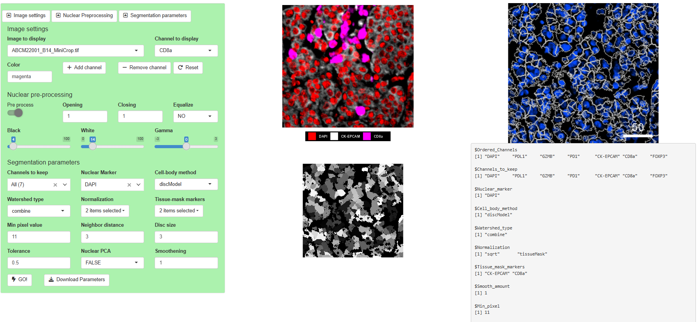

<style>
p {
  text-align: justify;
}
</style>

```{r, include = FALSE}
knitr::opts_chunk$set(
  collapse = TRUE,
  comment = "#>"
)
```


```{r setup, results='hide'}
library(CSM)
```

## Index

- [Introduction](#introduction)
- [Test dataset info](#test-datasets)
- [Segmentation based on watershed algorithm](#segmentation-based-on-watershed-algorithm)
    - [Testing segmentation parameters](#segmentation-tester-app)
    - [Performing cell segmentation](#performing-cell-segmentation)

***

## Introduction


## Test datasets

The test datasets consists of two small 500x500 pixels breast carcinoma TIFF images. They have been 
stained with a multiplexed immunofluorescence protocol for the following markers: 
"DAPI", "PDL1", "GZMB", "PD1", "CK-EPCAM", "CD8a", "FOXP3". 
The original images can be found at: https://immunoatlas.org/.

```{r Images, results='hide'}
#Generate a temporary directory to place the input images
Input_Dir <- tempfile(pattern = "tempdir1_Input")
dir.create(Input_Dir, recursive = TRUE)

#Save images in Input directory
purrr::map(1:2,
function(Image){
   EBImage::writeImage(CSM_MiniMultiTiff_test[[Image]],
   file.path(Input_Dir, names(CSM_MiniMultiTiff_test)[Image]))
})
```

## Segmentation based on watershed algorithm
CSM implements cell segmentation based on the [watershed algorithm](https://en.wikipedia.org/wiki/Watershed_(image_processing) "link to Wikipedia"). Watershed-based cell segmentation
is fast and computationally efficient. However, the user should take into account that this type of algorithms are limited when it comes to identify cell boundaries in very densely 
populated areas. Anyways, with adequate parameter tuning this algorithm can perform nicely with very little computational cost. CSM implements watershed-based cell segmentation thanks 
to the simpleSeg Bioconductor package.
In order to maximize the capabilities of watershed-based cell segmentation process there are several parameters that need to be carefully tuned:

* __Nuclear channels:__ The algorithm requires at least one nuclear marker. The marker must have a good signal to noise ratio and clearly delineate cell nuclei. Several nuclear markers can be
provided. If so, the algorithm will combine nuclear channels into one single image. Merging can also be performed by Principal Component Analysis (PCA).

* __Nuclear channel pre-processing:__ Nuclear channels provide the main information to perform watershed-based segmentation. If the channels containing cell nuclei information are noisy,
or nuclei show plenty of empty spaces, they will not serve their purpose. Therefore, CSM allows the user to pre-process nuclear channels to improve segmentation results. Image opening or closing can
be used to remove small noisy areas or fill holes in nuclei. In addition, the minimum and maximum pixel values can be provided as well as the gamma correction to modify the pixel value histogram.

* __Smoothening:__ Image-channels can be pre-processed to remove noise. One of the most common ways is to apply gaussian filters to smooth out contours.

* __Cell-body method:__ Once the cell nuclei have been identified the algorithm can optionally infer the cell's cytoplasm.This can be done by nuclear mask dilation (enlarging the nuclear mask by
a user defined number of pixels) or by inferring cytoplasms based on cytoplasmic markers.

* __Watershed type:__ The algorithm may identify boundaries by differences in intensity, by distance to closest background pixel or both.

* __Normalization:__ Pixel values may be pre-processed using several different approaches. In addition, background pixels can be identified by the expression pattern of certain key tissue defining 
image channels.

* __Minimum pixel value:__ If any cell identified is smaller than this user provided parameter, it will be removed from the segmentation mask.

* __Neighbor distance:__ The minimum distance (in pixels) required to keep two cells as independent objects. Small values result in higher number of cells identified.

* __Disc size:__ If cytoplasmic dilation is to be performed, the size (in pixels) of the nuclear mask dilation.

* __Tolerance:__ The minimum height of the object in the units of image intensity between its highest point (seed) and the point where it contacts another object (checked for every contact pixel).
If the height is smaller than the tolerance, the object will be combined with one of its neighbors, which is the highest.

### Segmentation tester app
In order to make the parameter tuning process easier, CSM implements a shiny App to interactively test segmentation parameters.
The function allows the user to test all the above mentioned parameters. In addition, if the user zooms in the main image panel, only the zoomed in area will be tested, speeding up the
testing process. Once the parameters are found to be adequate, the user can save the results in an object in the global environment by hitting the `Download Parameters` button.

```{r, echo=FALSE, out.width="100%"}

```


```{r app, eval = FALSE}
#Can only run interactively
Input_Dir <- tempfile(pattern = "tempdir1_Input")
dir.create(Input_Dir, recursive = TRUE)

#Save images in Input directory
purrr::map(1:2,
function(Image){
   EBImage::writeImage(CSM_MiniMultiTiff_test[[Image]],
   file.path(Input_Dir, names(CSM_MiniMultiTiff_test)[Image]))
})

#Launch the app------------------------------------------------------------
Segmentator_tester_app(
  Directory = Input_Dir,
  Ordered_Channels = c("DAPI", "PDL1", "GZMB", "PD1", "CK-EPCAM", "CD8a", "FOXP3")
)
```

### Performing cell segmentation
Once the segmentation parameters have been tuned, the user can perform cell segmentation. At the end of this process, the user will obtain a cell feature matrix where
every cell is encoded in a unique row. Each cell has information regarding X, Y coordinates, basic shape features (size, radius, sphericity...) and mean channel expression (taking into account
the whole cell surface area). In addition, the user can compute expression quantiles and texture features (the user must provide the pixel distance to compute GLCM).

```{r Segmentation, eval = FALSE}
#Get the images
Input_Dir <- tempfile(pattern = "tempdir1_Input")
dir.create(Input_Dir, recursive = TRUE)

#Save images in Input directory
purrr::map(1:2,
function(Image){
   EBImage::writeImage(CSM_MiniMultiTiff_test[[Image]],
   file.path(Input_Dir, names(CSM_MiniMultiTiff_test)[Image]))
})

#Check a segmentation parameters list obtained using the dedicated function----------
print(CSM_SegmentParams_test)

#Run the cell segmentation and feature extraction process (can only run interactively)--
Cell_segmentator_quantificator(
  Directory = Input_Dir,
  Parameter_list = CSM_SegmentParams_test,
  N_cores = 1,
  quantiles_to_calculate = c(0.05, 0.25, 0.5, 0.75, 0.95)
)

#Remove directories---------------------------------------------------------
unlink(Input_Dir, recursive = TRUE)
```


```{r Session_info, eval = TRUE, fig.align='center', out.width='100%', fig.width = 10, fig.height = 8}
sessionInfo()
```
